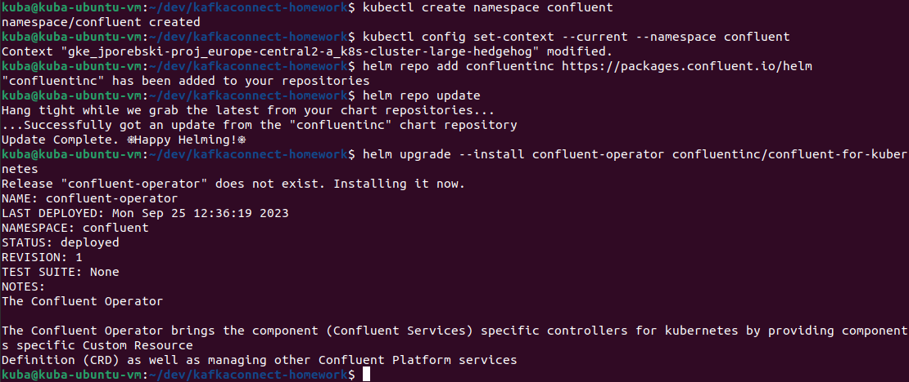

# Kafka Connect homework

## Prerequisites
You have to install utilities: confluent-hub, gcloud CLI tool, kubernetes CLI tool, etc. I tried to do this homework within my Ubuntu VM.

## Steps to recreate

### Create a custom docker image

* For running the GCS connector, you can create your own docker image. Create your GCS connector image and build it. To do it, go to `connectors` directory and execute a command: 
```
docker build -t jp/gcs-kafka-connector .
```

* You can also tag this image immediately - for purpose of pushing it into GCP Artifact Repository (where docker images can be stored):

```
docker tag jp/gcs-kafka-connector europe-central2-docker.pkg.dev/jporebski-proj/jporebski-repo/gcs-kafka-connector:v1
``` 

### Launch Confluent for Kubernetes

#### Create a namespace

- Create the namespace to use:

  ```cmd
  kubectl create namespace confluent
  ```

- Set this namespace to default for your Kubernetes context:

  ```cmd
  kubectl config set-context --current --namespace confluent
  ```

### Install Confluent for Kubernetes

- Add the Confluent for Kubernetes Helm repository:

  ```cmd
  helm repo add confluentinc https://packages.confluent.io/helm
  helm repo update
  ```

- Install Confluent for Kubernetes:

  ```cmd
  helm upgrade --install confluent-operator confluentinc/confluent-for-kubernetes
  ```

You can see results in the following screenshot:



## Create your own connector's image

* Make sure you have created your own connector's docker image using provided Dockerfile and use it in confluent-platform.yaml. See this file in the repo, so you can see my own changes.

### Install Confluent Platform

* Install all Confluent Platform components:

  ```cmd
  kubectl apply -f ./confluent-platform.yaml
  ```

* Install a sample producer app and topic:

  ```cmd
  kubectl apply -f ./producer-app-data.yaml
  ```

* Check that everything is deployed:

  ```cmd
  kubectl get pods -o wide 
  ```

* Results are following:


### View Control Center

- Set up port forwarding to Control Center web UI from local machine:

  ```cmd
  kubectl port-forward controlcenter-0 9021:9021
  ```

* Browse to Control Center: [http://localhost:9021](http://localhost:9021). You can see that it's working in the next step.

## Create a kafka topic

* Name the new topic: "expedia".


## Prepare the GCS connector configuration

* Use service account JSON key to access the bucket using GCS connector.

## Upload the connector file through the API

* TODO. I had to deal with cryptic error when uploading via UI. However I suppose error will be the same when uploading thru the API?
```
java.lang.NoClassDefFoundError: Could not initialize class com.google.api.services.storage.Storage
```
